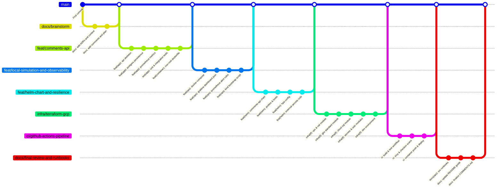

# Plano de Implementação: Desafio Técnico DevOps Sênior

> **For agentic workers:** REQUIRED SUB-SKILL: Use superpowers:subagent-driven-development (recommended) or superpowers:executing-plans to implement this plan task-by-task. Steps use checkbox (`- [ ]`) syntax for tracking.

**Goal:** Implementar de ponta a ponta a solução do Desafio Técnico de Analista DevOps Sênior: API REST de comentários em Python/FastAPI, conteinerização não-root, observabilidade nativa (Prometheus/Grafana), Helm chart resiliente com HPA, infraestrutura como código (IaC) modular em Terraform para GCP (VPC, GKE, Cloud SQL, Secret Manager, OIDC) e pipeline CI/CD GitHub Actions com verificações de segurança (Trivy e Checkov).

**Architecture:** A aplicação é empacotada em container distroless/slim rodando como não-root, implantada no cluster GKE via Helm e provisionada via Terraform no GCP. O tráfego interno com o Cloud SQL ocorre por IP privado via Private Services Access e os segredos são reconciliados pelo External Secrets Operator (ESO) via Workload Identity. O pipeline GitHub Actions autentica via OIDC (sem credenciais estáticas), varre vulnerabilidades e promove o deploy. A validação pode ser executada 100% localmente via Docker Compose + KinD ou diretamente na nuvem GCP.

**Tech Stack:** Python 3.12 (FastAPI, SQLAlchemy, asyncpg, Pydantic, pytest), Docker, Kubernetes (GKE Standard, Helm 3, Ingress NGINX, HPA), Prometheus & Grafana, GCP (VPC, Cloud NAT, Cloud SQL Postgres 16, Secret Manager, Workload Identity Federation), Terraform, GitHub Actions, Trivy, Checkov.

## Global Constraints

- Provedor de Nuvem padronizado: Google Cloud Platform (GCP).
- Compute: GKE Standard com node pool de custo otimizado (Spot/Preemptible).
- Banco: Cloud SQL PostgreSQL 16 com Private IP (sem IP público).
- Segredos: GCP Secret Manager integrado via External Secrets Operator (ESO).
- Usuário de container: Não-root (`appuser` UID 10001, GID 10001).
- Segurança de pipeline: Scan com Trivy (container) e Checkov (IaC Terraform) com threshold de bloqueio.
- Autenticação CI/CD: OIDC Workload Identity Federation (zero chaves JSON de Service Account).

---

## Estratégia de Branches e Fluxo de Commits

Seguindo a recomendação do desafio ("faça um fork e publique todos os commits no seu fork. Queremos ver seu fluxo de trabalho: commits pequenos, mensagens claras, PR/MR"):

---

## Tarefas de Implementação

### Fase 1: API de Comentários em Python FastAPI

#### Task 1.1: Estrutura Base da API, Models e Schemas Pydantic
**Files:**
- Create: `app/requirements.txt`
- Create: `app/src/main.py`
- Create: `app/src/config.py`
- Create: `app/src/models.py`
- Create: `app/src/schemas.py`
- Create: `app/tests/conftest.py`
- Create: `app/tests/test_api.py`

**Interfaces:**
- Consumes: Variáveis de ambiente (`DATABASE_URL`, `PORT`, `LOG_LEVEL`).
- Produces: FastAPI App instance, Schemas (`CommentCreate`, `CommentResponse`), Models (`Comment`).

- [ ] **Step 1: Escrever teste unitário com pytest para os endpoints `/health` e `/api/comment`**
- [ ] **Step 2: Rodar teste para verificar falha esperada**
- [ ] **Step 3: Implementar schemas Pydantic e FastAPI app minimal**
- [ ] **Step 4: Rodar teste para verificar aprovação**
- [ ] **Step 5: Commit**: `git commit -m "feat(app): add fastapi comments api skeleton and pydantic models"`

#### Task 1.2: Persistência Assíncrona com PostgreSQL e SQLAlchemy
**Files:**
- Create: `app/src/database.py`
- Modify: `app/src/main.py`
- Modify: `app/src/models.py`
- Modify: `app/tests/test_api.py`

**Interfaces:**
- Produces: `POST /api/comment/new`, `GET /api/comment/list/{id}`, async database session dependency `get_db`.

- [ ] **Step 1: Escrever testes assíncronos de inserção e busca de comentários por content_id**
- [ ] **Step 2: Rodar teste para verificar falha**
- [ ] **Step 3: Implementar database connection assíncrona e endpoints completos com persistência**
- [ ] **Step 4: Rodar suite de testes com SQLite em memória / Postgres mock**
- [ ] **Step 5: Commit**: `git commit -m "feat(app): add async postgres database persistence with sqlalchemy"`

#### Task 1.3: Instrumentação de Métricas Prometheus e Health Probe Detalhado
**Files:**
- Modify: `app/src/main.py`
- Modify: `app/requirements.txt`
- Modify: `app/tests/test_api.py`

**Interfaces:**
- Produces: Endpoint `/metrics` no formato Prometheus e `/health` validando conectividade com o banco.

- [ ] **Step 1: Escrever teste de validação do `/metrics` e integridade do `/health`**
- [ ] **Step 2: Executar testes para confirmar falha**
- [ ] **Step 3: Integrar `prometheus-fastapi-instrumentator` expondo contadores HTTP, latência e status do DB**
- [ ] **Step 4: Executar testes e validar aprovação de 100% da suíte**
- [ ] **Step 5: Commit**: `git commit -m "feat(app): add prometheus metrics instrumentator and health probe"`

#### Task 1.4: Containerização Hardened Multi-Stage Não-Root
**Files:**
- Create: `app/Dockerfile`
- Create: `app/.dockerignore`

- [ ] **Step 1: Criar Dockerfile multi-stage com `python:3.12-slim` criando usuário `appuser` (UID 10001)**
- [ ] **Step 2: Realizar build da imagem localmente (`docker build -t comments-api:test ./app`)**
- [ ] **Step 3: Testar execução do container como não-root e verificar `/health`**
- [ ] **Step 4: Executar scan preliminar de vulnerabilidades**
- [ ] **Step 5: Commit**: `git commit -m "feat(container): add hardened multi-stage non-root dockerfile"`

---

### Fase 2: Ambiente Local e Stack de Observabilidade

#### Task 2.1: Docker Compose com Auto-Provisionamento de Observabilidade
**Files:**
- Create: `docker-compose.yml`
- Create: `ops/prometheus/prometheus.yml`
- Create: `ops/grafana/provisioning/datasources/prometheus.yaml`
- Create: `ops/grafana/provisioning/dashboards/dashboard.yaml`
- Create: `ops/grafana/comments-api.json`

- [ ] **Step 1: Configurar scraper do Prometheus para a API**
- [ ] **Step 2: Construir dashboard JSON do Grafana com painéis de RPS, Latência (p50, p95, p99), Erros 5xx, Conexões DB**
- [ ] **Step 3: Configurar `docker-compose.yml` integrando PostgreSQL, API, Prometheus e Grafana**
- [ ] **Step 4: Subir e testar o ambiente em 1 comando (`docker compose up -d`)**
- [ ] **Step 5: Commit**: `git commit -m "feat(ops): add docker-compose with postgres, api, prometheus, and grafana"`

#### Task 2.2: Regras de Alerta Prometheus e Script KinD Local
**Files:**
- Create: `ops/alerts/comments-api-alerts.yaml`
- Create: `ops/scripts/test-local-kind.sh`

- [ ] **Step 1: Elaborar regras PromQL para alertas de Alta Latência (p95 > 200ms), Taxa de Erro 5xx (> 1%) e API Down**
- [ ] **Step 2: Criar script bash interativo `test-local-kind.sh` para subir cluster KinD, Ingress-NGINX e instalar Helm chart**
- [ ] **Step 3: Validar a execução local do script**
- [ ] **Step 4: Commit**: `git commit -m "feat(ops): add prometheus alert rules and kind bootstrap script"`

---

### Fase 3: Helm Chart e Resiliência Kubernetes

#### Task 3.1: Helm Chart `comments-api` com Probes, Recursos e Ingress
**Files:**
- Create: `helm/comments-api/Chart.yaml`
- Create: `helm/comments-api/values.yaml`
- Create: `helm/comments-api/templates/deployment.yaml`
- Create: `helm/comments-api/templates/service.yaml`
- Create: `helm/comments-api/templates/ingress.yaml`
- Create: `helm/comments-api/templates/configmap.yaml`
- Create: `helm/comments-api/templates/serviceaccount.yaml`

- [ ] **Step 1: Estruturar templates Helm com liveness probe, readiness probe e resource requests/limits**
- [ ] **Step 2: Configurar Ingress parametrizável suportando Ingress NGINX e GCE Ingress**
- [ ] **Step 3: Executar `helm lint helm/comments-api` e `helm template`**
- [ ] **Step 4: Commit**: `git commit -m "feat(helm): scaffold comments-api helm chart with deployment, service, and ingress"`

#### Task 3.2: Resiliência: HPA e External Secrets Operator
**Files:**
- Create: `helm/comments-api/templates/hpa.yaml`
- Create: `helm/comments-api/templates/externalsecret.yaml`
- Modify: `helm/comments-api/values.yaml`

- [ ] **Step 1: Configurar manifest de HPA baseado em métricas de CPU e Memória (min 2, max 10 réplicas)**
- [ ] **Step 2: Configurar manifest de `ExternalSecret` e `SecretStore` vinculando ao GCP Secret Manager**
- [ ] **Step 3: Validar sintaxe com `helm lint`**
- [ ] **Step 4: Commit**: `git commit -m "feat(helm): add horizontal pod autoscaler and external secrets manifests"`

---

### Fase 4: Infraestrutura como Código (Terraform GCP)

#### Task 4.1: Módulos de Rede (VPC + Cloud NAT) e Segurança
**Files:**
- Create: `infra/terraform/modules/vpc/main.tf`
- Create: `infra/terraform/modules/vpc/variables.tf`
- Create: `infra/terraform/modules/vpc/outputs.tf`

- [ ] **Step 1: Escrever módulo de VPC com subnets privadas, secundárias para pods/services do GKE e Cloud NAT**
- [ ] **Step 2: Validar sintaxe com `terraform fmt` e `terraform validate`**
- [ ] **Step 3: Commit**: `git commit -m "infra(terraform): add vpc and cloud nat module"`

#### Task 4.2: Módulo GKE Standard e Workload Identity
**Files:**
- Create: `infra/terraform/modules/gke/main.tf`
- Create: `infra/terraform/modules/gke/variables.tf`
- Create: `infra/terraform/modules/gke/outputs.tf`

- [ ] **Step 1: Escrever módulo GKE Standard com cluster privado, node pool Spot e Workload Identity ativado**
- [ ] **Step 2: Validar e executar `checkov` preliminar**
- [ ] **Step 3: Commit**: `git commit -m "infra(terraform): add gke standard cluster and node pool module"`

#### Task 4.3: Módulo Cloud SQL PostgreSQL em Rede Privada
**Files:**
- Create: `infra/terraform/modules/cloudsql/main.tf`
- Create: `infra/terraform/modules/cloudsql/variables.tf`
- Create: `infra/terraform/modules/cloudsql/outputs.tf`

- [ ] **Step 1: Configurar instância Cloud SQL Postgres com Private Services Access, sem IP público**
- [ ] **Step 2: Configurar database e usuário com geração aleatória segura de senha**
- [ ] **Step 3: Commit**: `git commit -m "infra(terraform): add cloud sql postgresql module with private ip"`

#### Task 4.4: Módulos de Segredos e OIDC Workload Identity Federation
**Files:**
- Create: `infra/terraform/modules/secrets/main.tf`
- Create: `infra/terraform/modules/secrets/variables.tf`
- Create: `infra/terraform/modules/secrets/outputs.tf`
- Create: `infra/terraform/modules/workload_identity_federation/main.tf`
- Create: `infra/terraform/modules/workload_identity_federation/variables.tf`
- Create: `infra/terraform/modules/workload_identity_federation/outputs.tf`

- [ ] **Step 1: Configurar Secret Manager para persistência da string de conexão**
- [ ] **Step 2: Configurar Pool e Provider OIDC do GCP para o GitHub Actions**
- [ ] **Step 3: Commit**: `git commit -m "infra(terraform): add secret manager and workload identity federation modules"`

#### Task 4.5: Ambiente `environments/dev/` Completo
**Files:**
- Create: `infra/terraform/environments/dev/main.tf`
- Create: `infra/terraform/environments/dev/variables.tf`
- Create: `infra/terraform/environments/dev/outputs.tf`
- Create: `infra/terraform/environments/dev/terraform.tfvars.example`

- [ ] **Step 1: Compor todos os módulos com parâmetros de custos otimizados**
- [ ] **Step 2: Executar `terraform fmt`, `terraform validate` e varredura do Checkov**
- [ ] **Step 3: Commit**: `git commit -m "infra(terraform): compose dev environment with cost-optimized variables"`

---

### Fase 5: Esteira de CI/CD (GitHub Actions)

#### Task 5.1: Pipeline de Integração Contínua com Scans de Segurança (Trivy e Checkov)
**Files:**
- Create: `.github/workflows/ci.yml`

- [ ] **Step 1: Configurar jobs de lint, pytest, Checkov (IaC scan) e Trivy (container scan)**
- [ ] **Step 2: Configurar thresholds de falha para vulnerabilidades críticas**
- [ ] **Step 3: Commit**: `git commit -m "ci(github): add ci pipeline with test, checkov, and trivy scans"`

#### Task 5.2: Pipeline de Deploy Contínuo (CD) com Autenticação OIDC
**Files:**
- Create: `.github/workflows/cd.yml`

- [ ] **Step 1: Configurar autenticação via `google-github-actions/auth` com OIDC Workload Identity**
- [ ] **Step 2: Configurar push para o Artifact Registry do GCP**
- [ ] **Step 3: Configurar deploy via Helm no GKE com verificação de rollout (`helm upgrade --install`)**
- [ ] **Step 4: Commit**: `git commit -m "ci(github): add cd pipeline with gcp oidc auth and helm deploy"`

---

### Fase 6: Runbooks SRE e Documentação Final

#### Task 6.1: Runbooks Operacionais de Resiliência
**Files:**
- Create: `ops/runbooks/incident-response.md`
- Create: `ops/runbooks/rollback-procedure.md`
- Create: `ops/runbooks/database-disaster-recovery.md`

- [ ] **Step 1: Documentar procedimentos de resposta a incidentes e triagem de alertas**
- [ ] **Step 2: Documentar procedimentos de rollback com Helm e kubectl**
- [ ] **Step 3: Documentar rotina de backup e restore no Cloud SQL**
- [ ] **Step 4: Commit**: `git commit -m "docs(ops): add incident response, rollback, and db restore runbooks"`

#### Task 6.2: Consolidação do README.md e COMMENTS.md
**Files:**
- Modify: `README.md`
- Modify: `COMMENTS.md`

- [ ] **Step 1: Atualizar README.md com instruções passo a passo (local e GCP), arquitetura visual e endpoints**
- [ ] **Step 2: Consolidar COMMENTS.md com evidências de testes executados e retrospectiva**
- [ ] **Step 3: Commit**: `git commit -m "docs: finalize README and COMMENTS with execution guide and test evidence"`
